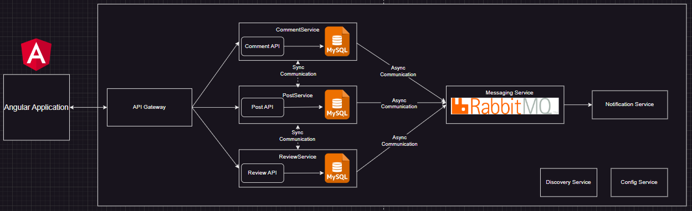

# Architectuur

## 1. Angular Applicatie
De Angular-applicatie is de front-end die gebruikers in staat stelt om de verschillende functionaliteiten van de applicatie te gebruiken, zoals het aanmaken van posts, het bekijken van posts, en het plaatsen van reacties. De Angular-applicatie communiceert via de API Gateway met de backend-microservices.

## 2. API Gateway
De API Gateway werkt als een tussenlaag tussen de Angular-applicatie en de backend-microservices. Het biedt één enkel toegangspunt voor de front-end om verschillende API’s aan te spreken. Voorbeelden:

- Bij US1 zal de API Gateway verzoeken naar de PostService doorsturen om nieuwe posts aan te maken.
- Voor US4 stuurt de API Gateway het verzoek naar de PostService om een overzicht van gepubliceerde posts op te halen.

## 3. PostService (Microservice)
De PostService is verantwoordelijk voor het beheren van posts, inclusief het aanmaken, bewerken, opslaan als concept, en het weergeven van gepubliceerde posts.

- **US1 en US2**: De redacteur kan via de PostService nieuwe posts aanmaken en opslaan als concept.
- **US3**: Voor het bewerken van een post wordt de PostService gebruikt, die wijzigingen opslaat in de MySQL-database.
- **US4 en US5**: De gebruiker kan gepubliceerde posts zien en filteren op inhoud, auteur, en categorie, wat ook wordt afgehandeld door de PostService.

## 4. ReviewService (Microservice)
De ReviewService is verantwoordelijk voor de goedkeuringsworkflow van posts. Hier worden posts beoordeeld en kan goedkeuring of afwijzing worden gegeven.

- **US7**: De redacteur kan ingediende posts bekijken en beslissen of deze worden goedgekeurd of afgewezen.
- **US8**: Zodra een post is goedgekeurd of afgewezen, stuurt de ReviewService een bericht naar de Messaging Service (RabbitMQ), wat resulteert in een notificatie voor de redacteur.
- **US9**: De ReviewService stelt de redacteur in staat om opmerkingen toe te voegen bij een afwijzing, zodat duidelijk is wat aangepast moet worden.

## 5. CommentService (Microservice)
De CommentService is bedoeld voor het beheer van reacties op posts.

- **US10**: Gebruikers kunnen reacties plaatsen op een post, wat wordt afgehandeld door de CommentService.
- **US11**: Andere gebruikers kunnen reacties lezen, zodat zij de meningen of vragen van collega's kunnen zien.
- **US12**: Gebruikers kunnen hun eigen reacties bewerken of verwijderen via de CommentService.

## Voorbeeld van synchrone communicatie tussen de PostService en CommentService:
Stap 1: Het aanvragen van een post
Een gebruiker vraagt via de Angular-applicatie om een specifieke post op te halen. De PostService ontvangt het verzoek en haalt de benodigde gegevens op uit de database.

Stap 2: Reacties op de post opvragen
Terwijl de PostService de gegevens van de post terugstuurt naar de Angular-applicatie, kan de CommentService synchrone communicatie gebruiken om reacties voor die post op te halen. De PostService maakt een HTTP-verzoek naar de CommentService om de reacties voor de specifieke post te verkrijgen.

Stap 3: Wachten op een antwoord
De CommentService verwerkt het verzoek en stuurt de reacties voor die post terug naar de PostService. De PostService wacht op deze gegevens van de CommentService voordat het het volledige antwoord met zowel de post als de reacties naar de Angular-applicatie terugstuurt.

Stap 4: Terugsturen naar de frontend
Zodra de PostService zowel de gegevens van de post als de reacties heeft ontvangen, stuurt deze het gecombineerde resultaat (de post met de reacties) terug naar de Angular-applicatie.

## 6. Messaging Service (RabbitMQ)
De Messaging Service (RabbitMQ) zorgt voor asynchrone communicatie tussen de services. Dit maakt het mogelijk om notificaties en meldingen op een efficiënte manier te verwerken, zonder dat de services synchroon hoeven te communiceren.

- **US8**: Bij goedkeuring of afwijzing van een post stuurt de ReviewService een bericht naar RabbitMQ. Dit bericht wordt dan verwerkt door de Notification Service, zodat de redacteur op de hoogte wordt gebracht.

## 7. Discovery Service en Config Service
De Discovery Service en Config Service ondersteunen de microservices-architectuur:

- De Discovery Service helpt bij het vinden van services in het netwerk, wat belangrijk is voor het opschalen en dynamisch verbinden van services.
- De Config Service beheert configuratie-instellingen voor de services, wat helpt bij het centraliseren van instellingen en versiebeheer.

## Samenvatting
RabbitMQ zorgt voor efficiënte asynchrone communicatie, wat vooral nuttig is voor notificaties en meldingen. Dit zorgt ervoor dat de applicatie schaalbaar en onderhoudbaar blijft. De Angular-applicatie communiceert met de API Gateway om alle benodigde backend-functionaliteit te bereiken, terwijl de backend-microservices zorgen voor gegevensbeheer, workflowbeheer, en asynchrone communicatie.
